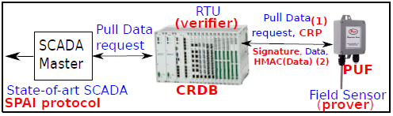
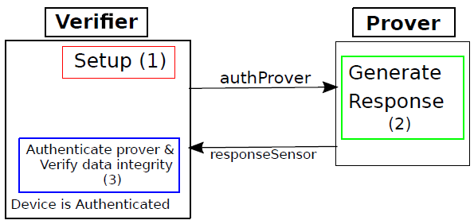

# SPAI Protocol
SRAM-based PUF Authentication and Integrity (SPAI) protocol addresses two significant security goals of SCADA systems. Firstly, it provides continuous integrity validation functionality of the data flow generated by the field sensors. Secondly, the embedded PUF allows remote terminal units (RTUs) to offer robust authentication function, thus, eliminating the rogue sensor devices in SCADA environment.

The SPAI protocol works in three phases, (1) profiling phase, (2) enrollment phase, and (3) authentication phase. We assume a secured and trusted environment on which the profiling and the enrolment phase are executed. The profiling phase identifies the strongest cells in the SRAM, while the enrollment phase generates unique responses for each embedded SRAM-based PUF in all field sensors. The pair of unique challenges and responses are stored into a CRDB at the verifier. In the authentication phase, the verifier selects two random tuples for a given field sensor. If the field sensor regenerates the correct response, the sensor is considered authenticated. To address the security vulnerabilities discussed in section II, our protocol uses timestamps to eliminate replay attacks and keeps track of active requests to avoid DoS attacks.

    

    
    

    

    Process of Data Pulling from Field Sensor
    

## Profiling Phase
A PUF consists of two unique components (1) a challenge, and (2) a response. In the SRAM context, a challenge represents the location of a cell, and the response represents the bit value stored in the location. The bit value of each cell can not be guaranteed throughout the life cycle of the SRAM. Due to the volatility of responses in SRAMs, EC are needed to correct errors and generate stable responses. Through preliminary experiments, we found that the overhead of ECs, although negligible for previous PUF protocols, have significant overhead in the SCADA context. The SPAI protocol avoid the overhead of ECs by introducing a profiling phase that categorize the behavior of the SRAM. The profiling of the SRAM allows the prover to identify the strongest cells in the SRAM, thus eliminating the necessity of ECs. We identify stable cells with a data remanence algorithm, which through 1 000 power-up tests, we found 2,000 stable cells of a 128Kb SRAM with both 1s and 0s values. From the 2,000 stable cells 75% are stable ’1s’ and 35% are stable ’0s’. The number of stable cells and the percentage of ones and zeros can be determined during the implementation of the data remanence algorithm. We selected the cells that flipped their value in the shortest time (300ms).

## Enrollment Phase
In this step, the SPAI generates and stores a CRP required to authenticate the sensor. The steps are the following:
1) The verifier gets a challenge getChallenge(sBits, Ca).
2) The verifier appends the challenge CRDB:append(Ca).
3) Once the challenge Ca is generated, the verifier sends it through secure channels to the prover. During the enrollment phase, confidential information is exchanged, because of the critical nature of the information secure transmission channels are necessary.
4) Using the addresses in the challenge, the prover reads the bit value [0, 1] that is stored in the SRAM, creating a response Ra = getPUF(Ca).
5) The response must be kept secret if the attacker access this response. They can spoof the identity of the prover and eventually compromise the SCADA system.
6) Finally, the verifier appends the response to the CRDB using CRDB:append(Ra).

We consider that the SPAI protocol can repeat the enrollment phase as the storage capacity of the verifier allows. For demonstration, we use 2,000 stable cells for our evaluation, and set our challenge and response length to 256 bits.

## Authentication Phase
The authentication phase ensures the authenticity of requests and data flow integrity. The communication between verifier(s) and prover(s) during this phase can be over unsecured channels. Due to the properties of the SRAM-based PUF, lightweight crypto solutions, and the amount of information transmitted, the identity and security of all components in the systems will remain protected even if malicious user intercepts part or all transmitted data. The authentication phase has three steps (1), setup, (2) generate response, and (3) authenticate prover and verify data integrity.

    

    
    

    

    Process of Data Pulling from Field Sensor
    

Detailed information about the SPAI protocol can be found in the paper **Achieving Sensor Identification and Data Flow Integrity in Critical Cyber-Physical Infrastructures**
